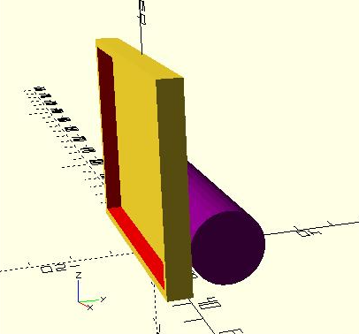

# Подсветка для рамки кадров рентгеноскопии / Frame Backlight

3D-printable model designed in OpenSCAD.
The backlight is powered by a 18650 Li-ion battery.

## Hyperlinks

1. [OpenSCAD double 18650 battery holder model](https://www.thingiverse.com/thing:456900) on Thingiverse
